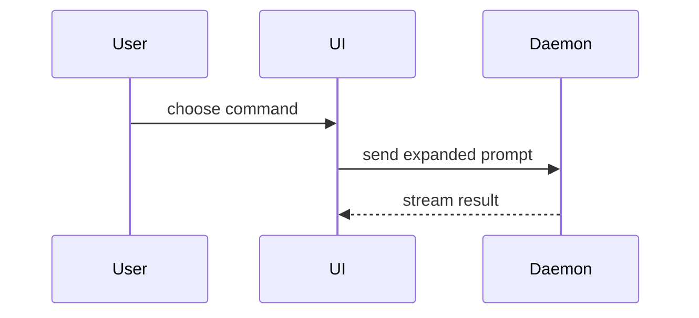

# Plan format — structured pseudocode instead of prose

How to *write down* anything whose subject is a **shape**: an implementation plan, a design proposal, a PRD's Implementation Decisions section, an `improve` proposed fix, an `explain` architecture-change note — or a plain chat answer that is about to describe logic, a call chain, a component tree, or a refactor in paragraphs. Write it so it reads as the shape of the code, not a description of it.

**Plain markdown only.** No HTML, no Monodraw, no rendered SVG. Every technique below is a fenced text block anyone can read in a terminal or a chat pane. Mermaid (technique 6) is the one exception, and only for a chat answer — never inside a plan or a written document, which have to survive in a terminal.

## Two triggers

### 1. A plan is being written — including mid-conversation

The trigger is what the *answer* will be, not what the request looked like. If the reply you are about to write says what to build, in what order, or what changes where, this skill owns its format. That includes the cases that arrive as ordinary conversation:

- "How would you go about implementing it?" → a numbered slice list is a plan.
- "What's your approach?" / "propose something" → a proposal is a plan.
- Answering a design question by describing a mechanism you'd add.
- A worker or dispatch brief reporting *what it intends to change* (findings alone are not a plan; the fix it proposes is).

An **option set** — a numbered list choosing between courses of action — is not a plan. `CLAUDE.md` §"Deciding & designing" owns that format: bolded numbered line, bullets, cost last.

### 2. An ordinary answer is about to draw a shape in prose

No plan, no file, no deliverable — just a reply mid-conversation whose subject is a shape. Pick the smallest view that makes the point, put it next to the short text it supports, and keep only the calls, files, props, states, and boundaries the current question needs.

- Explaining what a function or handler does step by step → pseudocode.
- Explaining what calls what at runtime → a call tree.
- Explaining where a component lives or what state it owns → a component tree.
- Explaining which directory is responsible for what → a shallow file tree.
- Explaining how two processes talk → Mermaid.
- Explaining what a change does to any of the above → the diff form of that same shape.

You may use one of these, you may use several; you will rarely use all of them in one reply. Don't overwhelm the user.

**Measured, not asserted.** Across 92 plan-shaped replies in 13 months of history: **68.5% carry no fenced block at all**, one carries a ```diff, and **zero** carry a component tree. Adherence to the rule overall is **39.1%**. The failure mode is never deciding this rule applies. It applies.

Reproduce with `python3 ~/.claude/skills/audit-session/adherence.py --rule plan-pseudocode --all-history`. An earlier version of this line said "122 replies, 56.6% bare" — that denominator counted subagent transcripts and harness JSON payloads that can never carry a plan. The corrected figure is worse on shape and better on rate; the reason for the skill is unchanged, because the cause was structural (the format lived at `skills/_plan-format.md`, opened 14 times in 9,243 transcripts).

## When to skip it

A plan already three lines long, or a decision with no structural shape — "which library to use" is a comparison table, not this. Skipping is a judgment you make *after* loading, not a reason to skip loading.

## Techniques

### 1. File labels

`path/to/file.ts:42` inline, next to any claim about existing code. Never invent a line number — only label a file you actually opened.

### 2. Type / interface signatures

Show the actual shape, not a description of it:

```ts
interface SessionState {
  userId: string
  expiresAt: Date
  refresh(): Promise<SessionState>
}
```

Composition and boundaries — what depends on what — matter more than full method bodies. Elide implementation with `...` or a one-line comment; the signature and its relationships are the plan.

### 3. Component trees

Before/after, indentation-based, for refactors that move state or consolidate effects. Only the nodes that move or change need to appear — prune the rest:

```
Before                            After
<Dashboard>                       <Dashboard>
  useEffect(fetchUser)              <UserProvider>
  useEffect(fetchOrders)              <Orders />
  <Orders orders={orders} />          <Profile />
  <Profile user={user} />           </UserProvider>
```

A single tree works the same way when the question is "where does this live" rather than "what moves". Label the nodes with the file that defines them and the hooks that own state — those are the boundaries the reader is asking about:

```tsx
<SessionPage> (apps/example/src/routes/session.tsx)
  useSessionEvents()
  <SessionToolbar>
    <RunSkillButton> (packages/ui)
```

The diff form shows a change to that same tree:

```diff
 <SessionPage>
   useSessionEvents()
   <SessionToolbar>
+    <RunSkillButton />
   <SessionTimeline>
+    <SkillResultCard />
```

### 4. Call-stack diffs

Before/after call flow as one diff block, not two side-by-side lists — the point is what specifically changes in the chain, not the whole chain restated twice:

```diff
 handleSubmit()
-  validate(form)
-  saveDraft(form)
+  validate(form)
+  await saveDraft(form)
+  trackEvent('submit')
   navigate('/success')
```

### 5. Generic diff syntax

For any before/after that isn't a full type or component — a config value, a function signature, a schema field — use a fenced ` ```diff ` block with `-`/`+` lines rather than narrating the change in prose ("change the timeout from 30s to 60s").

Use a diff when the surrounding shape already exists and the point is what changes. Show the **whole block** instead when most of it is new, when the omitted context would hide ownership or order, or when the user needs a copyable target shape:

```ts
function expandSkill(command: string): string {
  const skillName = command.slice(1)
  return `use the ${skillName} skill`
}
```

### 6. Pseudocode

For logic, an algorithm, or a state machine — the decision structure, none of the syntax:

```text
on(save)
  if content is unchanged
    return cached result
  write new content
  return fresh result
```

The diff form shows a change to the control flow:

```diff
 on(save)
-  write content
+  if content is unchanged
+    return cached result
+  write new content
+  invalidate cache
```

A runtime call tree is the same technique applied to what calls what:

```text
submitForm
  createSession
    persistPrompt
    launchAgent
  navigateToSession
```

### 7. Shallow file trees

For file responsibility or the shape of a broad refactor. One comment per directory saying what it owns — never a full recursive listing:

```text
src/
├── commands/       # parses user actions
├── sessions/       # owns session state
└── transport/      # sends API requests
```

```diff
 src/
 ├── commands/
+│   └── show-shape.ts    # expands the slash command
 ├── sessions/
-└── transport.ts
+└── transport/
+    ├── client.ts
+    └── stream.ts
```

### 8. Mermaid — chat answers only

For component interaction, control flow, or data flow between participants, where indentation can't show the back-and-forth:



**Only in a chat reply.** A plan, a PRD, an issue body, or any file on disk gets technique 4 or 6 instead — those are read in terminals and diffs, where Mermaid is unrendered noise.

## When a text block isn't enough

- The topic earns a standalone, keepable deliverable — a UI or layout comparison, a multi-layered concept, something the user will return to → `explain`.
- The point is what's worth reading in a large diff, not how to visualize one piece of it → `review`.

## Where this gets read from

- `CLAUDE.md` §4 — default technique for any implementation plan or architecture proposal.
- `to-spec`'s Implementation Decisions section — generalizes the prototype-snippet exception to any of the techniques above, not only output copied from a prototype run.
- `explain`'s Architecture / Process archetypes — a text-only alternative to the SVG signature diagram when the point is structural shape, not a rendered visual explanation.
- `improve`'s proposed-fix descriptions — show the shape of the fix, not just name it.

## Skills that load this automatically

These call `Skill(plan-format)` at the point they start writing a plan, so the format arrives without anyone remembering to ask for it:

- [`grill-me`](../grill-me/SKILL.md) — when an interview resolves into a stated plan or decision. This is also `implement`'s ambiguity path: `implement`'s Phase 0.5 objectivity failure routes to `grill-me` (`../implement/SKILL.md:138`), so an autonomous pass that hits a judgment call picks up this format on the way through. `implement` itself stays uninstrumented on purpose — a pass that clears the gate is walk-away work and should not stop to format a plan for a human.
- [`iron-out`](../iron-out/SKILL.md) — when writing the resolved plan onto an issue.
- [`prototype`](../prototype/SKILL.md) — when writing up which approach won and what to build.
